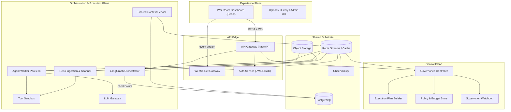
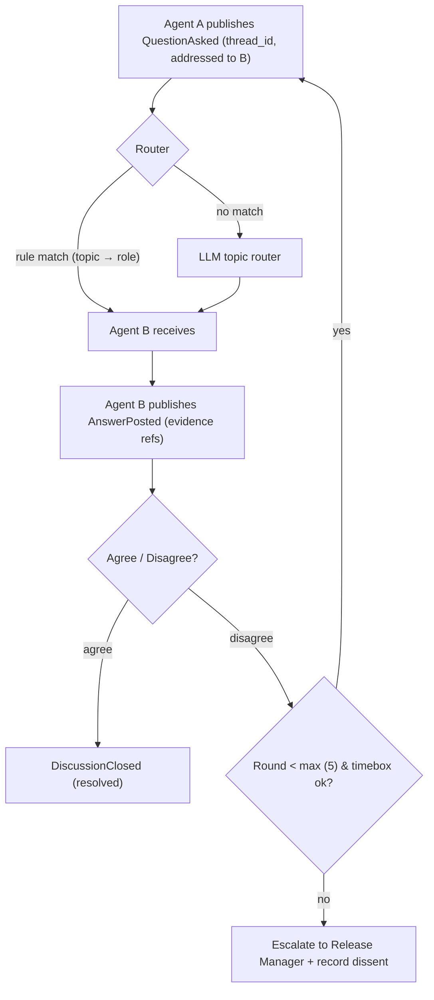
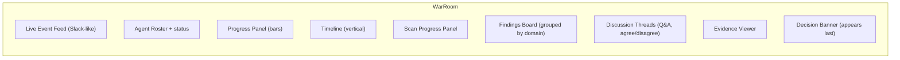

# Code Council AI — System Architecture

**Status:** Proposed (v1.0) · **Phase:** Architecture planning · **Scope:** Whole system
**Stack anchors:** Python (FastAPI) · LangGraph · Redis Streams · PostgreSQL · React/TypeScript · WebSockets

---

## 0. Executive Summary

Code Council AI is an **AI Engineering Review Board**: a panel of six specialized AI agents
(Security Officer, Software Architect, QA Lead, DevOps Lead, Red Team, Release Manager) that
collaborate, disagree, and collectively decide whether a repository is safe to release.

The system is built on five architectural principles:

1. **Event-driven everything.** Every meaningful mutation is an event on a shared event bus. The
   live "war room" dashboard is a *projection* of the run's event stream — nothing polls.
2. **Durable orchestration.** LangGraph executes each review as a stateful graph with Postgres
   checkpointing. A crashed process resumes from its checkpoint; it never restarts from scratch.
3. **Untrusted-by-default.** The uploaded repository is hostile input. It is scanned in sandboxed
   workers with no network egress and is never executed on the control plane.
4. **Mediated communication.** Agents do not chat freely. All communication flows through a shared
   context, structured findings, and governed discussion threads with hard budgets — no infinite
   debate loops.
5. **Auditable decisions.** The Release Manager's verdict is a structured record: weighted signals,
   per-domain findings, dissenting opinions, evidence links, and pinned model/prompt versions.

Three planes (Control, Execution, Experience) sit on a shared substrate (event bus, databases,
object storage, observability). Section 19 performs a formal design review and challenges the
weakest assumptions in this design.

---

## 1. Overall System Architecture

```
┌─────────────────────────────────────────────────────────────────────────────┐
│                        EXPERIENCE PLANE (client-facing)                      │
│   War Room Dashboard (React/TS)   ·   Upload / History / Admin UIs           │
└──────────────────────────────────┬──────────────────────────────────────────┘
                                   │ REST + WebSocket
┌──────────────────────────────────▼──────────────────────────────────────────┐
│                              API EDGE                                        │
│   API Gateway (FastAPI)  ·  WebSocket Gateway  ·  Auth Service (JWT/RBAC)   │
└──────────────────────────────────┬──────────────────────────────────────────┘
                                   │ commands + queries
┌──────────────────────────────────▼──────────────────────────────────────────┐
│                            CONTROL PLANE                                    │
│   Governance Controller  ·  Execution Plan Builder  ·  Policy & Budget       │
│   Store  ·  Supervision Watchdog                                            │
└──────────────────────────────────┬──────────────────────────────────────────┘
                                   │ execution plans, supervision signals
┌──────────────────────────────────▼──────────────────────────────────────────┐
│                     ORCHESTRATION & EXECUTION PLANE                         │
│   LangGraph Orchestrator (checkpointed)                                     │
│   Agent Worker Pools (6 roles)  ·  Repo Ingestion & Scanner                 │
│   Tool Sandbox  ·  LLM Gateway  ·  Shared Context Service                   │
└──────────────────────────────────┬──────────────────────────────────────────┘
                                   │
┌──────────────────────────────────▼──────────────────────────────────────────┐
│                           SHARED SUBSTRATE                                   │
│   Event Bus (Redis Streams)  ·  PostgreSQL (durable state + checkpoints)    │
│   Redis (cache, presence, locks)  ·  Object Storage (artifacts)             │
│   Observability (OpenTelemetry, structured logs)                            │
└─────────────────────────────────────────────────────────────────────────────┘
```

**What this diagram omits on purpose:** everything inside one plane is loosely coupled and
communicates through the event bus or REST, never through shared memory. Each plane scales
independently (Section 17).

---

## 2. High-Level Component Diagram



---

## 3. Responsibilities of Every Component

| # | Component | Plane | Responsibilities |
|---|-----------|-------|------------------|
| 1 | **API Gateway** | Edge | Exposes REST API; authenticates requests; validates payloads (upload size, schema); rate-limits; routes to Control Plane. |
| 2 | **WebSocket Gateway** | Edge | Owns client connections; subscribes to run event streams; fans out events; handles reconnect/resume cursors; heartbeats. |
| 3 | **Auth Service** | Edge | Issues/verifies JWTs; enforces RBAC (viewer / approver / admin); resolves tenant context. |
| 4 | **Governance Controller** | Control | Validates policy before every run; calls the Plan Builder; allocates budgets (tokens, time); assigns tool allowlists per role; supervises agents (watchdog); can pause, kill, or escalate runs; audits every governance action. |
| 5 | **Execution Plan Builder** | Control | Produces the run's DAG: nodes (agents, scan, discussion phases), dependency edges, concurrency limits, timeouts — derived from repo metadata + policy. |
| 6 | **Policy & Budget Store** | Control | Durable policies (who may run reviews, tool allowlists, budget ceilings, decision gates) and per-run budget ledger. |
| 7 | **Supervision Watchdog** | Control | Consumes heartbeat/stall events; detects dead agents, stuck nodes, budget overruns; emits remediation commands (retry, pause, kill, escalate). |
| 8 | **LangGraph Orchestrator** | Execution | Executes the plan as a stateful graph; maintains the run's orchestration state; checkpoints to Postgres after every node; emits step events; dispatches agent work to queues and awaits completion. |
| 9 | **Agent Worker Pools** | Execution | Six role-specialized pools (Security, Architecture, QA, DevOps, Red Team, Release Manager). Each worker: reads context → runs its agent loop via LLM Gateway → executes allowlisted tools in sandbox → writes structured findings/evidence → publishes events. |
| 10 | **Repo Ingestion & Scanner** | Execution | Accepts artifact from object storage; clones into sandbox; walks the tree; emits chunked progress events; runs static scans (secrets, dependency, language stats); produces the repo index. |
| 11 | **Tool Sandbox** | Execution | Isolated execution for all tools (scans, red-team probes); no network egress; CPU/memory/time limits; per-tool allowlists; captures outputs as evidence. |
| 12 | **LLM Gateway** | Execution | Provider abstraction (OpenAI/Anthropic/local); per-role model routing; structured-output enforcement; retries with backoff; token budget accounting; prompt & model version pinning; shared-evidence caching. |
| 13 | **Shared Context Service** | Execution | Reads/writes run-scoped context; enforces key ownership (agents write only their own findings); versioned; mirrors hot projections to Redis, durable writes to Postgres. |
| 14 | **Event Bus (Redis Streams)** | Substrate | Reliable delivery (consumer groups); per-run ordered streams; replay for dashboard resync and audit; TTL retention. |
| 15 | **PostgreSQL** | Substrate | System of record: runs, plans, findings, evidence, discussions, votes, decisions, policies, audit; LangGraph checkpoints. |
| 16 | **Redis** | Substrate | Streams; hot context cache; presence/heartbeat TTLs; mutex locks; rate-limit counters. |
| 17 | **Object Storage** | Substrate | Repo tarballs; evidence artifacts (scan reports, tool outputs); raw model responses. |
| 18 | **Observability** | Substrate | Structured logs, metrics, traces (OTel); dashboards for run health and cost. |
| 19 | **War Room Dashboard** | Experience | Live projection of the run: event feed, agent roster, progress bars, timeline, scan progress, findings board, discussion threads, decision banner. |
| 20 | **Upload/History/Admin UIs** | Experience | Start reviews; browse past runs; configure policies/agents/budgets. |

---

## 4. Communication Flow Between Components

All inter-component communication uses **four channels**:

| Channel | Direction | Protocol | Guarantees | Used for |
|---------|-----------|----------|-----------|----------|
| **Control REST** | Client ↔ Edge → Control/Execution | HTTP/JSON | Request/response, auth, rate-limited | Upload repo, start/cancel run, fetch snapshots, admin |
| **Command stream** | Governance → workers/orchestrator | Redis Streams (per-run control channel) | At-least-once, ordered | "start agent X", "pause", "kill", "escalate" |
| **Event stream** | Everyone → Event Bus | Redis Streams (XADD) | At-least-once, per-run total order | Findings, progress, heartbeats, questions, votes, decisions |
| **Dashboard push** | WS Gateway → clients | WebSocket frames | Ordered per run, resumable via cursor | Live UI updates |

**Cross-component rules:**

- Components **never read each other's memory or DBs directly**. The Shared Context Service is the
  only reader/writer of the context keyspace; the Event Bus is the only transport for telemetry.
- The Orchestrator communicates with agent pools **only** by: (a) enqueueing tasks to role queues,
  (b) receiving completion/status events back. This keeps the graph process from blocking on LLM
  latency (see Section 12, decision D12.2).
- The Governance Controller is **stateless**: every decision it makes is recorded as an event, so
  any replica can act on the same inputs and reproduce the same output (idempotent commands carry
  `request_id`).

---

## 5. Data Flow — Repository Upload → Final Decision

```mermaid
sequenceDiagram
  autonumber
  actor U as Engineer
  participant API as API Gateway
  participant OBJ as Object Storage
  participant GOV as Governance Controller
  participant LG as LangGraph Orchestrator
  participant SCAN as Repo Scanner
  participant BUS as Event Bus
  participant WSG as WS Gateway
  participant UI as War Room
  participant WK as Agent Pools
  participant RM as Release Manager
  participant PG as PostgreSQL

  U->>API: upload repo tarball
  API->>OBJ: store artifact (virus/zip-bomb checks)
  API->>PG: create Run (state=pending)
  API->>BUS: RunStarted
  BUS->>WSG: fan-out
  WSG->>UI: RunStarted
  API->>GOV: request execution plan
  GOV->>GOV: policy + budget validation
  GOV->>BUS: ExecutionPlanCreated (DAG)
  GOV->>LG: start run (plan, request_id)
  LG->>PG: checkpoint (run state)
  LG->>SCAN: ingest & scan
  SCAN-->>BUS: RepoScanProgress (chunked, % complete)
  BUS-->>WSG-->>UI: scan progress bar
  SCAN-->>PG: repo index (tree, languages, sizes)
  SCAN->>BUS: RepoIndexed
  LG->>WK: dispatch agents (parallel, per DAG edges)
  loop concurrent review & discussion
    WK-->>BUS: FindingPublished / QuestionAsked / Agreement / Disagreement / VoteCast
    BUS-->>WSG-->>UI: live feed, threads, evidence panels
    WK-->>PG: findings + evidence rows
  end
  LG->>LG: all nodes complete, discussions closed
  LG->>RM: handoff (Release Manager node)
  RM->>PG: read all findings, evidence, votes
  RM->>BUS: DecisionPending
  RM->>PG: write Decision (weighted, evidence-linked)
  RM->>BUS: DecisionMade
  BUS-->>WSG-->>UI: decision banner + summary
```

**Pipeline summary:**

| Stage | Trigger | Output | Emitted events |
|-------|---------|--------|----------------|
| 1. Upload | User uploads tarball | Stored artifact + Run row | `RunStarted` |
| 2. Govern | Run created | Validated plan (DAG), budgets, tool grants | `ExecutionPlanCreated` |
| 3. Ingest & scan | Plan ready | Repo index; risk hints (secrets, deps) | `RepoScanProgress*`, `RepoIndexed` |
| 4. Parallel review | Index ready | Per-agent findings + evidence | `AgentStarted`, `FindingPublished`, `AgentFinished` |
| 5. Discussion | Findings published | Resolved/disputed findings, votes | `QuestionAsked`, `AnswerPosted`, `Agreement`, `Disagreement`, `DiscussionClosed` |
| 6. Decide | All agents finished + discussions closed | Weighted verdict + reasons | `DecisionPending`, `DecisionMade` |
| 7. Close | Decision recorded | Archived run, notifications | `RunCompleted` |

---

## 6. Event-Driven Architecture for the Live Dashboard

### 6.1 Principle
The dashboard is a **read-model projection** of the run's event stream. Every agent action,
governance decision, and progress delta is an event; the UI applies events to local state with an
idempotent reducer. There is **no polling loop** in the UI.

### 6.2 Event taxonomy

| Event | Producer | Purpose |
|-------|----------|---------|
| `RunStarted` | API | Run exists |
| `ExecutionPlanCreated` | Governance | DAG is ready (UI renders timeline skeleton) |
| `RepoScanProgress` | Scanner | Chunked % + file counts → scan progress bar |
| `RepoIndexed` | Scanner | Index ready; agents may start |
| `AgentStarted` | Orchestrator | Agent picked up task |
| `AgentHeartbeat` | Workers | Liveness for roster + watchdog |
| `AgentToolInvoked` | Workers | Tool name, duration → activity feed |
| `FindingPublished` | Workers | Structured finding + evidence refs |
| `FindingUpdated` | Workers | Finding revised after discussion |
| `QuestionAsked` | Worker A | Addressed to agent(s) B |
| `AnswerPosted` | Worker B | Reply with evidence refs |
| `Agreement` / `Disagreement` | Workers | Position on a finding |
| `VoteCast` | Workers | Contribution to decision signal |
| `DiscussionClosed` | Governance | Thread budget reached / resolved |
| `AgentFinished` | Orchestrator | Agent work complete |
| `DecisionPending` | Release Manager | Final deliberation begun |
| `DecisionMade` | Release Manager | Verdict + summary |
| `RunCompleted` / `RunFailed` / `RunCancelled` | Orchestrator | Terminal states |
| `RunPaused` / `RunKilled` | Governance | Operator/controller intervention |
| `Error` | Any | Fatal or non-fatal, with `error_code` |

### 6.3 Ordering & delivery guarantees
- **Per-run total order.** Each run has its own stream `run:{id}:events`; Redis assigns
  monotonically increasing IDs. All ordering constraints in this system are per-run, so global
  ordering is unnecessary.
- **At-least-once delivery** via Redis consumer groups. Consumers must be **idempotent**:
  every event carries `event_id` (UUID) and handlers deduplicate on it.
- **Resume protocol.** Clients connect with `last_event_id`; the WS gateway replays from that
  cursor before switching to live push. This is the *only* mechanism needed for reconnect,
  page reload, and slow clients.

### 6.4 Backpressure & cost control
- **Progress events are aggregated** (per-N-files or per-directory), not per-file — prevents
  megabyte-scale event floods on large repos.
- **Heartbeat throttling**: agents emit heartbeats at a fixed cadence (default 30 s), not on every
  LLM token.
- **UI-side batching**: the reducer applies a small burst window (~100 ms) and renders once, so a
  finding burst does not cause N re-renders.
- If a consumer group lags, the gateway may **skip non-essential event types** (heartbeats) while
  keeping critical ones (findings, decisions) — the projection stays correct because heartbeats
  are transient.

---

## 7. WebSocket Integration

```mermaid
graph LR
  CLI1["Dashboard client"] -- "WS /ws/v1/events" --> WSG1["WS Gateway instance 1"]
  CLI2["Dashboard client"] -- "WS" --> WSG2["WS Gateway instance 2"]
  WSG1 --> BUS[(Redis Streams run:{id}:events)]
  WSG2 --> BUS
  BUS --> WSG1
  BUS --> WSG2
```

### 7.1 Protocol

| Phase | Message | Direction | Notes |
|-------|---------|-----------|-------|
| Handshake | `{type:"subscribe", run_id, token, last_event_id?}` | Client → GW | Auth via JWT; validates tenant access to run |
| Acknowledgement | `{type:"subscribed", run_id, cursor}` | GW → Client | `cursor` = stream position after replay |
| Live push | `{type:"event", event_id, seq, type, payload}` | GW → Client | Envelope is the bus event, unchanged |
| Resume | `{type:"resubscribe", last_event_id}` | Client → GW | Sent on reconnect; GW replays from cursor |
| Keepalive | `{type:"ping"}` / `{type:"pong"}` | Both | Every 30 s; GW drops silent clients |
| Error | `{type:"error", code, message}` | GW → Client | e.g. `UNAUTHORIZED`, `RUN_NOT_FOUND`, `CURSOR_GC` |

### 7.2 Design choices
- **Stateless gateways**: all state lives in Redis/Postgres, so any number of gateway instances can
  serve any client; fan-out uses bus consumption, not sticky sessions.
- **No inter-gateway pub/sub channel**: each gateway consumes the run's stream via its own consumer
  group. Cost is proportional to instances, which is fine at hackathon scale; the scale-up path is
  a dedicated fan-out tier (Section 17).
- **Auth on every subscribe**, not just connect — a client can hold many sockets.
- **Cursor GC**: `CURSOR_GC` is returned when the requested cursor has been deleted (stream TTL);
  client falls back to a REST snapshot + live tail.

---

## 8. How AI Agents Communicate

### 8.1 Three channels, in priority order

| Channel | Mechanism | Used for | Governed by |
|---------|-----------|----------|-------------|
| **1. Shared Context** | Run-scoped key-value context (Section 10) | Asynchronous collaboration: "who found what" | Key ownership rules |
| **2. Structured findings & votes** | Typed records with evidence refs | Formal positions, agreements/disagreements | Evidence-linking rules |
| **3. Addressed discussions** | Threads on the event bus | Direct questions ("do you consider X a blocker?") | Discussion budget (rounds, timebox) |

Agents **never** hold free-form back-and-forth conversations. The third channel exists precisely
because the product needs visible "agents asking each other questions" — but it is the most
dangerous channel (loop risk) and therefore the most restricted.

### 8.2 Discussion lifecycle



### 8.3 Loop and chaos prevention (enforced by Governance)

| Control | Default | Effect |
|---------|---------|--------|
| Max rounds per thread | 5 | Hard termination of debate |
| Thread timebox | 10 min | Prevents stalled threads from blocking the run |
| Routing | Rule-based topic→role with LLM fallback | Questions land on the right agent, not broadcast |
| Mandatory evidence refs | Yes | Positions must cite findings/artifacts — blocks hand-waving |
| Budget ledger | Per-agent token cap | A verbose agent cannot starve the run |
| Vote threshold | Configurable (e.g. ≥3 agreeing, none objecting) | Objective closure condition |
| Safe default | Unresolved P0 → **NO-GO** or human escalation | The system never "approves by default" |

---

## 9. How the Governance Controller Supervises Agents

### 9.1 Lifecycle state machine

```
plan → validate → allocate → assign → monitor → remediate → close
  │       │            │         │         │          │
  └───────┴────────────┴─────────┴─────────┴──────────┴── all steps emit audit events
```

1. **Validate** — policy checks: tenant entitlement, repo size/type allowlist, budget availability.
2. **Allocate** — per-agent budgets: token ceiling, wall-clock ceiling, tool grants.
3. **Assign** — writes the run's plan into the orchestrator; per-role tool allowlists into the
   sandbox registry.
4. **Monitor** — subscribes to the watchdog consumer group.
5. **Remediate** — on anomaly, emits a command with `request_id` (idempotent).
6. **Close** — on terminal state, reconciles the budget ledger and archives audit events.

### 9.2 Watchdog mechanisms

| Signal | Detection | Action |
|--------|-----------|--------|
| Missing heartbeat | No `AgentHeartbeat` for 2× cadence | Flag; retry once (LangGraph node retry); then kill + `AgentFinished(failed)` |
| Stalled node | Node no-op for > timeout | Re-route task; escalate if retry exhausted |
| Budget overrun | Token/time ledger exceeded | Pause agent; notify; allow operator resume or kill |
| Forbidden tool | Tool outside allowlist | Block call; log `SecurityViolation`; kill agent if repeated |
| Discussion loop | Thread exceeds max rounds | Auto-close + escalate (Section 8.3) |
| LLM failure | Gateway retries exhausted | Fallback model; degrade to cheaper role config; mark agent degraded |

The watchdog is itself a **stateless consumer group** — any replica can act; commands are
idempotent, so double-firing is harmless.

---

## 10. Shared Context Architecture

### 10.1 Model
Run-scoped context is the **collaboration blackboard**. It is read-mostly, write-rarely, and
strictly namespaced.

```
ctx:run:{run_id}:{
    repo        — index, languages, size, risk hints          [written by Scanner]
    findings    — per-agent findings (key: {agent}..{finding_id})
    evidence    — artifacts refs, tool outputs, raw LLM dumps
    threads     — discussion state (append-only messages)
    votes       — positions per finding
    decisions   — final verdict + reasoning                   [written by Release Manager]
}
```

### 10.2 Ownership & conflict rules
- **Each agent owns its findings prefix.** Agent A cannot overwrite Agent B's finding; it can only
  reference or contest it (contest = new discussion, not mutation). This eliminates the classic
  shared-blackboard race.
- **Threads are append-only.** Messages are immutable; edits are modeled as new messages.
- **Versioning:** every write carries `rev`; concurrent writers on shared keys (e.g., vote tally)
  use a deterministic merge: last-revision-wins for counters is unacceptable, so counters are
  stored as **append-only event counts** and derived on read.
- **Derived projections** (e.g., "x of y findings blocked") are computed at read time from the
  event stream — never stored, never stale.

### 10.3 Storage split

| Store | Role | Why |
|-------|------|-----|
| PostgreSQL | Durable system of record for context (findings, evidence, threads, votes, decisions) | Relational queries for history/admin; joins with runs/policies |
| Redis | Hot projection + cache of context for dashboard reads | Sub-millisecond reads during live viewing |
| Object Storage | Large evidence artifacts (scan outputs, model dumps) | Never in the hot path |

---

## 11. Event Bus Architecture

### 11.1 Topology (Redis Streams)

| Stream | Key | Consumers |
|--------|-----|-----------|
| Run events | `run:{id}:events` | WS Gateways (per-instance consumer group), Watchdog, Audit sink, Projection builders |
| Control commands | `run:{id}:ctrl` | Orchestrator, Agent pools |
| Global control | `sys:ctrl` | Governance replicas, Orchestrator |

- **Producers** call `XADD` with the event envelope (Section 6.3) — never await consumers.
- **Consumers** use consumer groups (`XREADGROUP`) with **at-least-once** semantics and dedupe on
  `event_id`.
- **Retention:** streams survive the run's active window + 24 h (dashboard replay), then are
  compacted into Postgres audit tables and purged (TTL). Long-term history lives in Postgres, not
  the bus.

### 11.2 Event envelope (contract, not code)

| Field | Type | Purpose |
|-------|------|---------|
| `event_id` | UUID | Idempotency/dedupe key |
| `run_id` | UUID | Partition key + ordering scope |
| `type` | Enum | From taxonomy (Section 6.2) |
| `seq` | int | Per-run monotonic position |
| `ts` | ISO-8601 | Producer time |
| `actor` | {role, agent_id?} | Who produced it |
| `payload` | Typed JSON | Event-specific; schema-versioned |
| `schema_ver` | int | Payload schema version |

### 11.3 Why Redis Streams (and when to move off)

- **Why now:** the stack already needs Redis (cache, presence, locks) — one more operational
  dependency costs nothing; Streams give consumer groups, per-key ordering, TTL, and replays in a
  familiar tool. Sufficient to tens of thousands of events/sec.
- **Scale path:** NATS JetStream or Kafka when throughput/durability needs grow (Section 17). The
  producer/consumer contracts above are broker-agnostic, so migration is an adapter change, not a
  redesign.

---

## 12. State Management Architecture

### 12.1 Three tiers of state

| Tier | Where | Owns | Recovery |
|------|-------|------|----------|
| **Domain state** | PostgreSQL | Runs, findings, evidence, discussions, decisions, policies | Always durable; source of truth for queries/history |
| **Orchestration state** | LangGraph checkpointer (Postgres, `AsyncPostgresSaver`) | In-progress graph position, node I/O per run (`thread_id` = run_id) | Crash → resume from last checkpoint, never restart |
| **Runtime/stream state** | Redis + client-side projection | Live cursors, presence, heartbeats, dashboard state | Ephemeral by design; rebuildable from events |

### 12.2 Orchestration design (LangGraph)
- The review graph is **coarse-grained and durable**: nodes are `ingest`, `scan`, each agent,
  discussion phases, `decide`. Heavy work inside a node is **delegated to worker queues** (async
  nodes that enqueue and await completion events) so the graph process never blocks on LLM calls.
- Checkpoint after every node → a crash loses at most one node's work.
- **Human-in-the-loop** (`interrupt()`) is used for: policy overrides, GO-with-conditions sign-off,
  and manual kill confirmations. The checkpointer guarantees resume at the exact point.

### 12.3 Client-side projection
- The dashboard keeps a **Zustand store** populated by: (1) REST snapshot on connect, (2) the WS
  event stream thereafter. The event reducer is **idempotent** (dedupes by `event_id`) and applies
  events in `seq` order.
- This is *event-sourcing-lite*: the event log is the source of truth for live state; Postgres is
  the source of truth for history; they reconcile because the bus is fed from the same writes that
  update Postgres (write-then-publish, Section 13).

### 12.4 Consistency rule
**Write-then-publish.** Any mutation first commits to Postgres, then publishes the event. The
REST snapshot (from Postgres) and the WS projection (from events) therefore always converge; at
worst, a fresh client sees a snapshot that is a few events behind and catches up via the cursor.

---

## 13. Backend Services

| Service | Language/Framework | Scale unit | Key concerns |
|---------|--------------------|------------|--------------|
| API Gateway | Python / FastAPI | Horizontal (stateless) | Validation, rate limits, auth |
| WebSocket Gateway | Python / FastAPI (WS) | Horizontal (stateless) | Connection lifecycle, resume cursors |
| Auth Service | Python / FastAPI | Horizontal | JWT, RBAC, tenant context |
| Governance Controller | Python | Horizontal (stateless, idempotent commands) | Policy, budgets, plan DAG, watchdog |
| LangGraph Orchestrator | Python / LangGraph | Per-run graph process (checkpointed) | Graph execution, retries, interrupts |
| Agent Worker Pools | Python | Per-role pools (scalable independently) | Agent loops, LLM calls, tool calls |
| Repo Ingestion & Scanner | Python | Queued workers | Cloning, indexing, static scans |
| LLM Gateway | Python | Horizontal | Provider routing, budgets, retries, structured output, caching |
| Shared Context Service | Python | Horizontal | Namespaced reads/writes, versioning |
| Notification Service (opt.) | Python | Horizontal | Outbound webhooks (Slack/email) on decisions |

**Team-level rationale:** a single Python monorepo keeps LangGraph, agent tooling, and the event
bus in one language, which is the highest-leverage simplicity for a hackathon while preserving
clean service boundaries.

---

## 14. Frontend Modules

### 14.1 War Room (the product centerpiece)



| Module | Data source | Behavior |
|--------|-------------|----------|
| Event Feed | WS events | Streaming entries: who did what, with links; auto-scroll w/ pause on hover |
| Agent Roster | `AgentStarted/Heartbeat/Finished` + REST | 6 cards: status (idle/working/questioning/degraded/failed), token meter, tool calls |
| Progress Panel | Aggregated progress events | Per-agent and overall run progress bars; ETA from event timestamps |
| Timeline | Lifecycle events + seq | Vertical timeline of phases; jumps to evidence/findings on click |
| Scan Panel | `RepoScanProgress/RepoIndexed` | File-count + % bar; languages/risk chips |
| Findings Board | `FindingPublished/Updated` + REST snapshot | Cards grouped by domain; severity/confidence badges; "contested" markers |
| Discussion Threads | Thread events | Q&A threads with agree/disagree actions and evidence refs; shows resolution or "escalated" |
| Evidence Viewer | Object Storage + REST | Renders scan snippets, tool outputs, raw model responses |
| Decision Banner | `DecisionMade` + REST | Sticky banner: GO / NO-GO / GO-with-conditions, score breakdown, dissent list, evidence links |

### 14.2 Supporting modules
Upload & Onboarding · Run History & Run Detail (read-only replay) · Admin (policies, agents,
budgets, tool allowlists) · Auth (login, roles) · Settings (tenant).

### 14.3 Frontend stack
React + TypeScript + Vite · **Zustand** (UI store + idempotent event reducer) · **TanStack Query**
(REST snapshots & mutations) · native WebSocket client with reconnect/resume · Tailwind CSS
(dark "ops theater" theme). No heavy real-time framework needed — the event-reducer pattern is the
architecture.

---

## 15. Database Modules

### 15.1 PostgreSQL (system of record)

| Module | Tables (representative) | Owned by |
|--------|-------------------------|----------|
| Identity & access | `users`, `teams`, `api_tokens`, `roles`, `memberships` | Auth Service |
| Repos | `repos`, `uploads` (artifact refs, hashes) | API Gateway / Scanner |
| Runs & plans | `runs`, `plan_nodes`, `plan_edges`, `run_assignments` | Governance / Orchestrator |
| Agents | `agent_defs` (role, model config), `agent_runs`, `agent_status` | Orchestrator |
| Findings & evidence | `findings`, `evidence`, `finding_links` (dependencies/contests) | Workers via Context Service |
| Discussions | `threads`, `thread_messages`, `thread_members`, `votes` | Governance (append-only) |
| Decisions | `decisions`, `decision_reasons`, `decision_overrides` | Release Manager |
| Policy | `policies`, `budgets`, `tool_allowlists`, `tenant_config` | Governance |
| Audit | `audit_events` (immutable, append-only), `event_archive` | Governance |

### 15.2 Redis keyspaces

| Keyspace | Purpose | TTL |
|----------|---------|-----|
| `run:{id}:events` / `run:{id}:ctrl` | Streams | run + 24 h |
| `run:{id}:presence:{agent}` | Heartbeat last-seen | 2× cadence |
| `run:{id}:lock` | Mutex for decision finalization | seconds |
| `ctx:run:{id}:*` | Hot context projection | run + 24 h |
| `rl:*` | Rate-limit counters | sliding window |

### 15.3 Object storage
`artifacts/{tenant}/{run_id}/repo.tar` · `evidence/{run_id}/{agent}/{artifact_id}` ·
`model-dumps/{run_id}/{agent}/{finding_id}.json` (raw responses for auditability).

---

## 16. API Modules

### 16.1 REST (control plane + snapshots)

| Method/Path | Purpose | Auth |
|-------------|---------|------|
| `POST /v1/runs` | Upload repo, start review | approver+ |
| `GET /v1/runs` · `GET /v1/runs/{id}` | List / snapshot (incl. plan, findings, status) | viewer+ |
| `POST /v1/runs/{id}/cancel` | Request cancellation | approver+ |
| `GET /v1/runs/{id}/findings` · `/evidence` · `/discussions` | Paginated reads | viewer+ |
| `POST /v1/runs/{id}/discussions/{t}/messages` | Human comment (agents reply via bus) | viewer+ |
| `GET /v1/runs/{id}/decision` | Final verdict + reasoning | viewer+ |
| `GET /v1/repos` · `GET /v1/agents` · `GET /v1/policies` | Catalog reads | viewer+ |
| `PUT /v1/policies/{id}` · `POST /v1/agents/{id}/override` | Policy/agent control | admin |
| `POST /v1/auth/login` · `/refresh` | Token issuance | public |
| `GET /v1/audit/events` | Immutable audit trail | admin |

### 16.2 WebSocket
`/ws/v1/events` — subscribe to one or more `run_id`s; resume via `last_event_id` (Section 7).

### 16.3 Webhooks (outbound, optional)
`decision.made` → configured endpoints (Slack/CI). Delivered from the Notification Service with
signature + retry.

---

## 17. Future Scalability Considerations

| Concern | Current approach (hackathon) | Scale path |
|---------|------------------------------|------------|
| Event throughput | Redis Streams, per-run streams | NATS JetStream/Kafka; broker-agnostic contracts already |
| WebSocket fan-out | Gateways consume streams directly | Dedicated fan-out tier (bus → gateway clusters) |
| Long-term analytics | Postgres queries | TimescaleDB / ClickHouse for event analytics |
| Orchestrator throughput | One graph process per run (checkpointed) | Multiple orchestrator replicas partitioned by run; queue-based delegation already |
| Multi-tenancy | `tenant_id` on every row/stream | Tenant-aware routing, per-tenant budgets, dedicated capacity |
| Model diversity & cost | Per-role model routing, budgets, caching | Dynamic model arbitration, spot/local models for cheap roles |
| Observability | OTel logs/metrics/traces | Cost attribution per run, anomaly detection on run latency |
| Resilience | Checkpointed resume, retries, circuit breakers | Chaos drills; cross-region durability for audit data |
| Repo size | Sandboxed scan with limits | Distributed scanning (tree sharding), incremental re-review (diff-only) |

---

## 18. Design Decisions & Rationale

| # | Decision | Alternatives considered | Chosen because | Trade-off accepted |
|---|----------|------------------------|----------------|--------------------|
| D1 | LangGraph orchestrator with Postgres checkpoints | Hand-rolled state machine; temporal/durable workflow engine | Native multi-agent graphs, streaming, `interrupt()`, checkpoint resume — exactly the live-war-room needs | Python-centric backend |
| D2 | Coarse graph nodes + queue delegation | Fine-grained nodes calling LLMs inline | Graph process never blocks on LLM latency; workers scale per role | Extra async plumbing |
| D3 | Redis Streams event bus | NATS, Kafka, RabbitMQ | Already need Redis; consumer groups + replay + per-key ordering; zero new ops | Not Kafka-grade durable; fine at scope |
| D4 | Event-sourcing-lite (events for live state, Postgres for history) | Full event sourcing; polling | Full sourcing is overkill; polling breaks the live UX; this gives both | Dual-write complexity (mitigated by write-then-publish) |
| D5 | WS gateway consumes bus per instance | Dedicated fan-out broker; socket.io | Simplest correct fan-out at hackathon scale | Fan-out cost grows with instances (Section 17) |
| D6 | Mediated agent communication with budgets | Free-form agent chat (multi-agent loops) | Free-form LLM chat is unbounded, un-budgetable, and a UX/audit hazard; this preserves the product's "debate" while staying safe | Some naturalness lost; compensated by visible threads |
| D7 | Owned namespaces on shared context | Single shared blackboard | Eliminates write races and overwrite bugs | Slight ceremony in key design |
| D8 | Weighted, policy-gated decision by Release Manager | Naive majority vote; single reviewer | Domain severity differs (a P0 secret leak ≠ a lint nit); veto powers + safe-default NO-GO prevent approval gaming | Scoring config needs care |
| D9 | Sandboxed, no-egress tool execution | Run tools in-process | The repo is untrusted input; red-team tools must never touch the network | Sandbox ops overhead |
| D10 | Per-role model routing + pinned versions | One model for all agents | Reduces correlated failure & groupthink; enables cost tiering; makes verdicts reproducible | Multi-provider key management |
| D11 | Write-then-publish consistency | Publish-then-write; eventual-only | REST snapshots and WS projections always converge | Slight latency before event visible |
| D12 | Monorepo, one language (Python) | Polyglot services | LangGraph + agents + bus in one language; fastest iteration for a hackathon | Later polyglot extraction costs |

---

## 19. Design Review — Challenged Decisions

A formal review of this design (and of the original brief) — the weak spots and how they are
resolved.

**C1. "Every AI agent begins working" (brief, as written).**
*Challenge:* Unbounded parallelism ignores dependencies (Red Team needs the scan + Security's
findings first; Release Manager must be last) and blows the budget on huge repos.
*Resolution:* The Execution Plan Builder emits a **DAG**, not a free-for-all. Parallel where
independent, serial where dependent; concurrency capped by a budget.

**C2. Groupthink — six agents on the same model will agree too readily.**
*Challenge:* A review board that rubber-stamps itself is worse than one reviewer.
*Resolution:* Per-role model routing + independent working before sharing + adversarial pairings
(Red Team is explicitly incentivized to break the Security Officer's conclusions). Dissent is a
first-class output, not a failure.

**C3. Infinite debate.**
*Challenge:* "Agents ask each other questions" is a loop generator; unbounded LLM conversation is
also unbounded cost.
*Resolution:* Hard discussion budget (rounds + timebox), mediated routing, evidence-linked
positions, escalation to Release Manager, safe-default NO-GO (Section 8.3).

**C4. Event flood on large repos.**
*Challenge:* Streaming every action is the product's core promise — but per-file progress on a
100k-file repo will melt the bus and the browser.
*Resolution:* Aggregated progress events, heartbeat throttling, UI burst batching, and the
"skip transient event types under lag" rule (Section 6.4).

**C5. The single Orchestrator is a SPOF.**
*Challenge:* If the graph process dies mid-run, the demo dies with it.
*Resolution:* Checkpoint-after-every-node (Postgres) + resume; the orchestrator is one of N
replicas partitioned by run. At worst, one node's work is redone.

**C6. Consensus gaming / false confidence.**
*Challenge:* Agents can be sycophantic or noisy; a majority of confident-but-wrong agents is
worse than one careful one.
*Resolution:* Every position requires evidence refs; confidence scores are calibrated against
model versions; policy gates (any unwaived P0 = block) override votes; unresolved P0 defaults to
NO-GO. Humans can override via `interrupt()` — with the override itself recorded.

**C7. The uploaded repo is hostile.**
*Challenge:* Scans and red-team tools execute code from the repo being reviewed.
*Resolution:* Repo is cloned and run **only** in the sandbox (no egress, resource caps,
decompression-bomb guards); artifacts are hash-verified; the control plane never executes repo
code. Extracted credentials are *findings*, never used.

**C8. Cost explosion — six LLM agents × discussion loops.**
*Challenge:* This system's cost is 6× a single-reviewer tool, and debates multiply it.
*Resolution:* Per-run/agent token budgets; role-tiered models (cheap/fast for QA stats, strongest
for Security/Red Team); shared-evidence caching in the LLM gateway; early economy only via
policy, never by skipping mandatory roles.

**C9. Provider outage = silent review failure.**
*Challenge:* Six agents on one provider = six correlated failures.
*Resolution:* LLM gateway fallback chain (alternate provider, alternate model); per-role
degradation; agents mark themselves `degraded` (visible on the roster) rather than failing
silently.

**C10. Reproducibility of AI verdicts.**
*Challenge:* "Why did we block release?" must be answerable after the fact.
*Resolution:* Findings pin model + prompt versions; raw model responses are stored as evidence;
audit events are immutable; the decision record links every reason to evidence.

**C11. Write races on shared context.**
*Challenge:* Concurrent agents writing one blackboard will clobber each other.
*Resolution:* Ownership namespaces + append-only threads + derived-on-read aggregates (Section 10).

**C12. Latency of "final decision appears only after all discussion."**
*Challenge:* Users may wait 10+ minutes for the verdict — the one thing that must not feel
indeterminate.
*Resolution:* The dashboard makes the wait legible: live timelines, per-agent progress, budget
counters, and a `DecisionPending` state with ETA. The UX promise is "nothing feels stuck," not
"fast verdict."

---

## Appendix A — Agent roles, tools, outputs

| Agent | Primary inputs | Allowlisted tools | Outputs | Model tier |
|-------|----------------|-------------------|---------|------------|
| Security Officer | Repo index, secrets scan | Secret detectors, dep. vuln scanner (read-only) | Findings (severity, CWE), risk posture | Strongest |
| Software Architect | Repo index, language stats | Static analyzers, complexity metrics | Architecture findings, tech-debt ratings | Mid |
| QA Lead | Tests, scan results | Test-run harness (sandboxed), coverage tools | Test findings, coverage gaps | Mid |
| DevOps Lead | Infra files, CI configs | Config linters (sandboxed) | Deployment-risk findings | Mid |
| Red Team | Findings, evidence, index | Exploit probes, fuzzers (sandbox, no egress) | Adversarial findings; contests Security findings | Strongest |
| Release Manager | All findings, evidence, votes | None (read-only) | Weighted verdict + reasons + dissent list | Strongest (final) |

## Appendix B — Glossary

- **Run** — one review of one repository snapshot; owns its event stream and context.
- **Execution Plan (DAG)** — ordered, dependency-constrained node graph for a run.
- **Finding** — structured, evidence-linked observation by one agent.
- **Thread** — governed Q&A between agents (or human ↔ agent).
- **War Room** — the live dashboard projection of a run.
- **Watchdog** — governance consumer group detecting stalls/dead agents.
